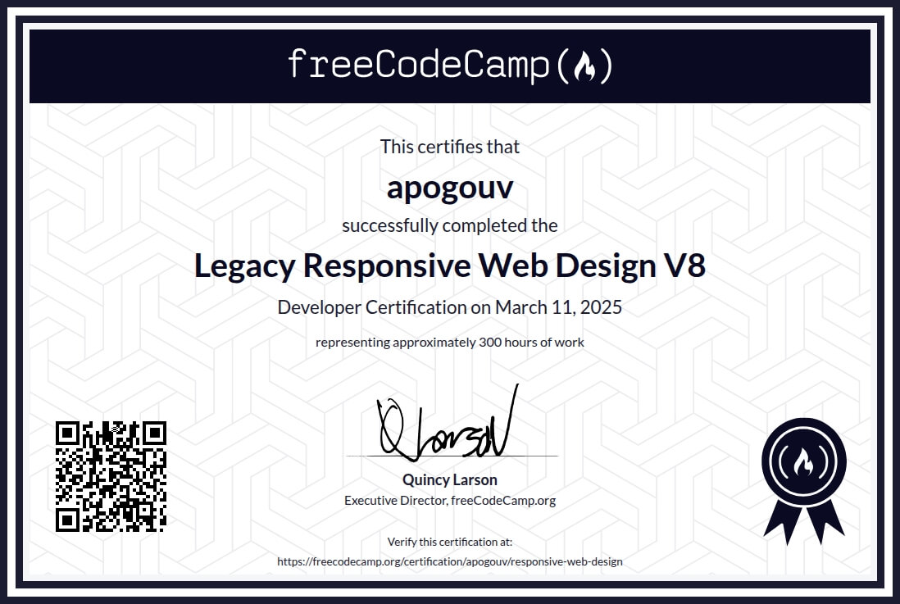

# freeCodeCamp Legacy Responsive Web Design V8 Certification

## Certificate

Completed the **Legacy Responsive Web Design V8 Certification** from freeCodeCamp in March 2025. 

[View the certificate](https://www.freecodecamp.org/certification/apogouv/responsive-web-design)

## Projects

This directory contains the projects and exercises completed throughout the freeCodeCamp Responsive Web Design curriculum.

The five certification projects are:

1. **Build a Tribute Page**

2. **Build a Survey Form**

3. **Build a Product Landing Page**

4. **Build a Technical Documentation Page**

5. **Build a Personal Portfolio Webpage**

The other directories contain the smaller projects and exercises completed while progressing through the curriculum.

## Notes

This work was originally completed in a separate repository and was later moved into [`cs-lab`](../../..), my personal computer science and software engineering learning repository.
